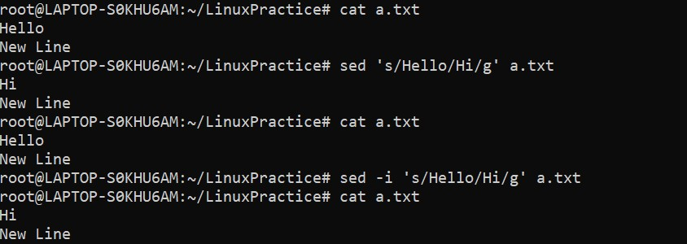

# Day-6 SRE Training
## Topic - Linux

Linux is an open-source, Unix-like operating system that manages hardware and software resources on a computer. It is widely used in servers, embedded systems, cloud computing, and personal computers. It offers security, stability, and flexibility, with various distributions like Ubuntu, CentOS, and Debian.

## Basic Linux Commands

### Print Working Directory
```sh
pwd  # Prints the current directory path
```

### Listing Files and Directories
```sh
ls       # Lists files and directories in the current location
ls -l    # Long format with permissions, owner, size
ls -a    # Shows hidden files
ls -lrt  # Lists files sorted by modification time (oldest first), in reverse order
```

### Changing Directories
```sh
cd folder_name  # Changes the current directory
cd Documents   # Moves into the Documents folder
cd ..          # Moves up one directory
```


### Creating Files and Directories
```sh
mkdir folder_name  # Creates a new directory
mkdir -p path/to/folder  # Creates parent directories if they don’t exist
touch file_name  # Creates an empty file
touch {1..5}.txt  # Creates files 1.txt, 2.txt, 3.txt, 4.txt, and 5.txt
```


### Removing Files and Directories
```sh
rm file.txt  # Deletes a specific file
rm -r folder  # Deletes a folder and its contents
rm -rf *  # Removes all files and directories in the current directory recursively
```

### Copying and Moving Files
```sh
cp -r folder1 folder2  # Copies a folder and its contents
cp file1 file2  # Copies a file
mv oldname.txt newname.txt  # Renames or moves a file
mv file.txt /home/user/Documents/  # Moves a file to another location
```


### Writing and Appending Text
```sh
echo "Hello, World!"  # Prints text in the terminal
echo "Hello" > file.txt  # Writes text to a file (overwrites content)
echo "New line" >> file.txt  # Appends text to a file
```


### History and Help Commands
```sh
history  # Lists previously used commands
clear  # Clears the terminal screen
man command_name  # Shows help documentation for a command
```

### Searching for Text in Files
```sh
grep -Ril "error" log.txt  # Searches for specific text in a file
# Flags:
# -R: Recursive search in directories
# -i: Case-insensitive search
# -l: Show only filenames with matches
```


## File Permissions

### Permission Types
- **Read (r)**: View file content or list directory contents
- **Write (w)**: Modify file content or add/remove files in a directory
- **Execute (x)**: Run a file as a program or enter a directory

### User Categories
- **User (u)**: File owner
- **Group (g)**: Users in the same group
- **Others (o)**: All other users

### Understanding Permissions
```sh
ls -l  # Displays file permissions
```
Example output:
```sh
-rwxr-xr--  1 user group 1234 Mar 4 12:00 file.txt
```
- `rwx` (Owner: read, write, execute)
- `r-x` (Group: read, execute)
- `r--` (Others: read only)

### Changing Permissions
```sh
chmod 720 file.txt  # Sets permissions
```
**Numeric Representation:**
- **r = 4, w = 2, x = 1**
- **Sum of permissions:**
  - `rwx = 4 + 2 + 1 = 7`
  - `rw- = 4 + 2 = 6`
  - `r-- = 4`
- Example:
  ```sh
  chmod 720 file.txt  # Owner: rwx (7), Group: w (2), Others: no permissions (0)
  ```


### System Monitoring Commands
```sh
df -h  # Displays disk usage in human-readable format
ps aux  # Lists currently running processes
```

### Editing Files Using `sed`
```sh
sed 's/old/new/g' file.txt  # Modifies file content without opening it
sed -i 's/old/new/g' file.txt  # Modifies and saves file content without opening it
```

