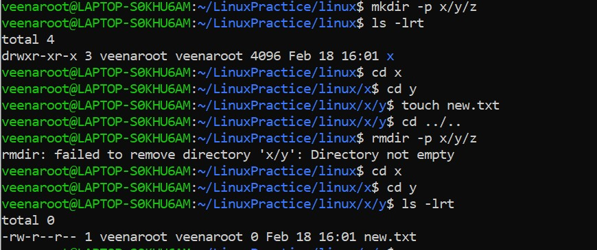
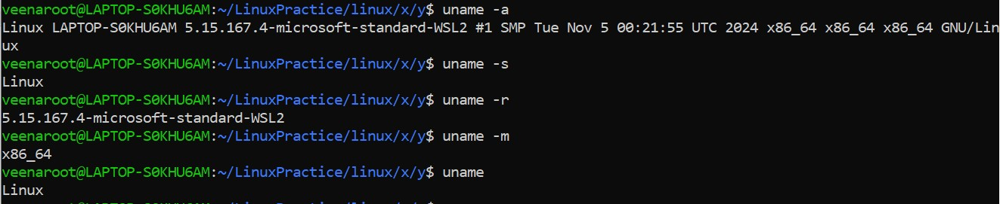
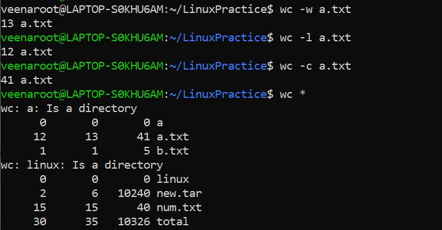
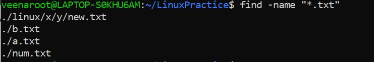
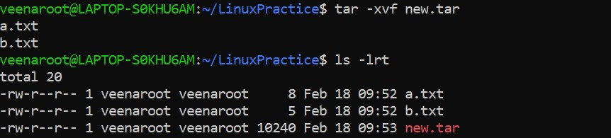
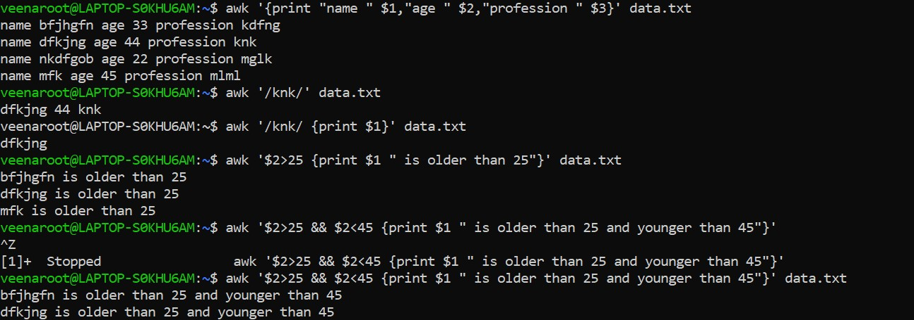

# Day-7 SRE Training

## Topic - Linux Commands and Basic Shell Scripting

### Directory and File Management
- `rmdir -p` → Removes empty directories along with their parent directories recursively if they are also empty.
- `mkdir -p a/b/c` → Creates nested directories `a/b/c`, ensuring parent directories exist.
- `rmdir -p a/b/c` → Removes `c`, then `b` (if empty), then `a` (if empty).
- `mkdir -p x/y/z`
- `touch x/y/file.txt` → Creates a file inside `y`.
- `rmdir -p x/y/z` → Removes only `z` because `y` is not empty.

### System Information Commands
- `uname -a` → Displays all system information (kernel name, version, architecture, etc.).
- `uname -s` → Shows the kernel name (e.g., Linux).
- `uname -r` → Displays the kernel release version.
- `uname -m` → Shows the system architecture (e.g., x86_64).
- `uname` → By default, prints the kernel name (same as `uname -s`).

### Process Management Commands
- `ps aux` → Lists all running processes with detailed information.
- `kill processid` → Terminates a process by its Process ID (PID).
- `kill -9 processid` → Forcefully terminates a process.

### Sorting Commands
- `sort` → Sorts lines of text in ascending order.
- By default, sort is case-sensitive. Uppercase letters come before lowercase letters in the ASCII table. To ignore case sensitivity, use the `-f` flag.
- `sort -r` → Sorts lines of text in reverse (descending) order.
- `sort -n` → Sorts lines of text numerically.

### Word and Line Counting
- `wc -w filename.txt` → Counts the number of words in the file `filename.txt`.
- `wc -l filename.txt` → Counts the number of lines in the file `filename.txt`.
- `wc -c filename.txt` → Counts the number of bytes (characters) in the file `filename.txt`.
- `wc *` → Counts words, lines, and bytes for all files in the current directory.

### Calendar Commands
- `ncal` → Displays the current month's calendar.
- `ncal 12 2025` → Displays the calendar for December 2025.
- `ncal -3` → Displays the previous, current, and next months' calendars.
- `ncal 1990` → Displays the calendar for the entire year 1990.

### File Finding Commands
- `find -name "*.txt"` → Finds all files with a `.txt` extension in the current directory and subdirectories.
- `find . -type d` → Finds all directories (excluding files) starting from the current directory (`.`).
- `find . -name "*.tmp" -exec rm {} \;` → Finds all files with a `.tmp` extension in the current directory and subdirectories and removes them.

  

### Command History and Filtering
- `history | grep command` → Displays the list of all previously used commands in the terminal. The `|` is the pipe operator, passing the output to `grep` which searches through history for the specified command.

  

### Archiving and Compression
- `tar -cvf archive.tar directory/`
- `tar`: The command for working with tar archives.
- `-c`: Create a new archive.
- `-v`: Verbose mode, shows the progress.
- `-f`: Specifies the name of the archive (`archive.tar`).

- `tar -xvf archive.tar`
- `-x`: Extracts the contents of the archive.

- `tar -tvf archive.tar`
- `-t`: Lists the contents of the archive without extracting it.

- `tar -czvf archive.tar.gz directory/`
- `-z`: Compresses the archive using gzip.

- `tar -xzvf archive.tar.gz`
- `-z`: Decompresses the archive using gzip.

  

### Aliases and Network Commands
- `alias j1="ls -lrt"` → Creates an alias named `j1` for the `ls -lrt` command.
- `lsof` → Lists open files and processes that have those files open.
- `ip a` → Displays network interfaces and their IP addresses.
- `ncdu .` → A disk usage analyzer for visualizing disk usage.

### Networking and Shell Usage
- `ping www.google.com` → Sends ICMP echo requests to test network connectivity.
- `echo $SHELL` → Prints the value of the `$SHELL` environment variable.
- `head -2 name.txt` → Displays the first 2 lines of the `name.txt` file.
- `tail -2 name.txt` → Displays the last 2 lines of the `name.txt` file.

### AWK Commands
- `awk '{print $1}' data.txt` → Prints the first column of each line.
- `awk '{print $1 $2 $3}' data.txt` → Prints the first, second, and third columns without spaces.
- `awk '/exp/' data.txt` → Prints lines that contain "exp".
- More complex conditions can be added with additional expressions.

### Shell Scripting
- `echo "$var_1$var_2"` → Prints the concatenation of variables.
- `unset var_1` → Removes the variable `var_1`.
- `echo $var_1` → Prints an empty line if `var_1` was unset.
- `readonly var_2` → Makes `var_2` read-only.
- `read username` → Waits for user input and assigns it to a variable.
