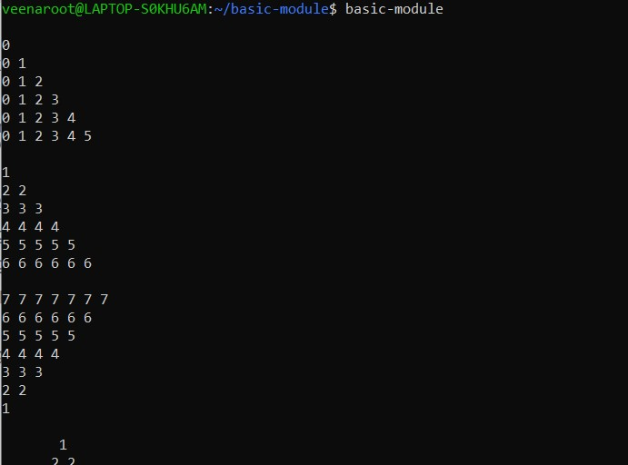

# Day-10 SRE Training

## Topic: CI (Continuous Integration)

Continuous Integration (CI) is a DevOps practice where developers frequently merge code
changes into a shared repository, followed by automated builds and tests. This helps detect and
fix issues early, ensuring a stable and reliable codebase.

## pyproject.toml
`pyproject.toml` is a configuration file used in modern Python packaging. It defines how a project
should be built, its dependencies, metadata, and tools like `setuptools`.

### Sections in `pyproject.toml`
- **[build-system]**: Specifies build dependencies.
- **[project]**: Includes package name, version, dependencies, and scripts.
- **[project.scripts]**: Defines a command-line script (`basic-module`) that runs `main()` from `pattern.py`.
- **[tool.setuptools]**: Specifies the package directory.

## `__init__.py` Files
The `__init__.py` files serve two main purposes:

1. **`src/basic_module/__init__.py`**
   - Marks `basic_module` as a Python package.
   - Allows importing modules from `basic_module` (e.g., `from basic_module import datastructure`).

2. **`src/basic_module/datastructure/__init__.py`**
   - Marks `datastructure` as a subpackage.
   - Allows importing modules from `datastructure` (e.g., `from basic_module.datastructure import pattern`).

Without `__init__.py`, Python wouldn’t recognize `basic_module` or `datastructure` as packages, leading to import errors.

## Wheel (.whl) Package
A Wheel (`.whl`) package is a binary distribution format for Python packages. It speeds up
installation because it doesn’t require building from source.

### Why is a Wheel Package Necessary?
1. **Faster Installation** – No need to compile source code; just extract and use.
2. **Cross-Platform Compatibility** – Works on different systems without modification.
3. **Reduces Dependencies** – Avoids issues with missing compilers or dependencies.
4. **Standardized Packaging** – Ensures consistent installation with `pip install`.

### Building a Wheel File
```sh
python3 -m build --wheel
```
This command creates a `.whl` file inside the `dist/` directory, ready for distribution.

### After Building a Wheel File (`.whl`), You Can:
#### Install the Wheel Locally:
```sh
pip install dist/basic_module-0.1.0-py3-none-any.whl --force-reinstall
```
- Installs your package from the built wheel file.

#### Distribute the Wheel File:
- Share the `.whl` file with others so they can install it using:
  ```sh
  pip install your_package.whl
  ```
- No need to share source code.

### Running the Installed Package
Once you install the package, you can run the `basic-module` command in the terminal:
- This executes the `main()` function from `pattern.py`, as defined in `pyproject.toml`.
- When you type `basic-module`, Python looks for the installed script.
- It runs `main()` inside `src/basic_module/datastructure/pattern.py`.
- The script outputs whatever logic is defined in `main()`.



### Installing in Editable Mode
```sh
pip install -e .
```
- Installs your package in **editable mode** (also called **development mode**).
- The `-e` (editable) flag creates a **symbolic link** between your source code and the installed package.
- The `.` tells `pip` to install the package from the **current directory**.

#### No Need to Rebuild (`.whl`) After Code Changes
- When you modify your code (e.g., `pattern.py`), changes take effect immediately.
- No need to rerun `python3 -m build --wheel` or reinstall the package.

