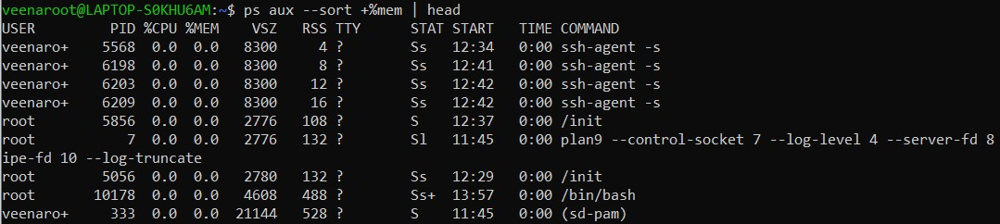
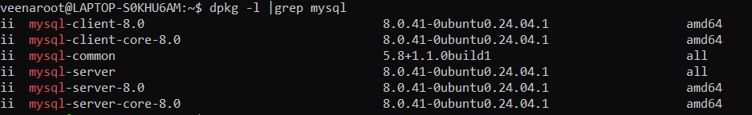

## Day-12 SRE Training  
### Topic: Advanced Linux Commands  

### System Monitoring Commands  
- `free -h` → Displays system memory usage in a human-readable format.  
- `ps` → Lists currently running processes.  
- `ps aux --sort -%mem` → Lists all running processes, sorted by memory usage in descending order. The processes consuming the most RAM appear at the top.  
- `ps aux --sort +%mem` → Lists all running processes, sorted by memory usage in ascending order (lowest memory usage first).  
- `top` → Provides a real-time view of system processes, CPU, and memory usage.  
- `ping chatgpt.com` → Checks network connectivity to `chatgpt.com`.  
- `nslookup google.com` → Resolves the IP address of `google.com`.  
- `ifconfig` → Shows network interfaces and their IP addresses (deprecated, use `ip a`).

### File & Package Management  
- `stat a.txt` → Displays detailed information about the file `a.txt`.  
- `sudo apt update` → Updates the package list from repositories.  
- `sudo apt search firefox` → Searches for `firefox` in available packages.  
- `sudo apt search python` → Searches for `python` in available packages.  
- `dpkg -l` → Lists installed Debian packages.  
- `dpkg -l | grep mysql` → Filters the installed packages containing `mysql`.  
- `sudo apt upgrade` → Upgrades installed packages to the latest version.  
- `sudo apt remove stress` → Removes the `stress` package.

### User & Group Management  
- `sudo adduser root1` → Creates a new user `root1` with a home directory.  
- `su - root1` → Switches to user `root1`.  
- `sudo userdel -r root1` → Deletes user `root1` and their home directory.  
- `ps -u root1` → Lists processes running under `root1`.  
- `sudo pkill -9 -u root1` → Forcefully terminates all processes of `root1`.  
- `sudo useradd -m roottest` → Creates a new user `roottest` with a home directory.  
- `sudo passwd roottest` → Sets a password for `roottest`.  
- `finger roottest` → Shows user details (if `finger` is installed).  
- `sudo usermod -a -G c406cohort roottest` → Adds `roottest` to the `c406cohort` group.  
- `sudo chgrp c406cohort /home/grouptry` → Changes the group of `/home/grouptry` to `c406cohort`.  
- `sudo chgrp c406cohort /home/grouptry/root1/a` → Changes the group of `a` inside `/home/grouptry/root1/`.  
- `sudo chmod 2775 grouptry/` → Sets group ownership (`2` sets SGID, `775` gives read/write/execute to group).  
  - **SGID (Set Group ID)**  
    - The `2` at the beginning sets the **SGID (Set Group ID) bit**.  
    - When SGID is set on a directory, all new files and subdirectories inside inherit the group of the parent directory instead of the creating user's primary group.  
- `sudo chmod g+s grouptry/root1/a` → Ensures files inside inherit the group of the parent directory.

### SSH Key Setup for GitHub  
- `ssh-keygen -t rsa -b 4096 -C "@gmail.com"` → Generates an RSA SSH key.  
- `eval "$(ssh-agent -s)"` → Starts the SSH agent.  
- `ssh-add ~/.ssh/id_ed25519` → Adds the SSH key to the agent (should match the key type generated).  
- `cat ~/.ssh/id_ed25519.pub` → Displays the public key to add to GitHub.  
- `ssh -T git@github.com` → Tests SSH authentication with GitHub.  

### Printing & System Logs  
- `lpq` → Displays the printer queue. Shows pending print jobs.  
- `dmesg` → Displays system boot and hardware logs.  
- `dmesg | tail -50` → Shows the last 50 lines of system logs.  
- `dmesg | grep "USB"` → Filters logs to show USB-related messages.  

### Network Performance & Testing  
- `iperf` → Tests network speed between two systems.  
- `sudo apt install iperf` → Installs `iperf` if not already installed.  
- `iperf -s` → Starts `iperf` in **server mode** to receive network speed tests.  
- `iperf -s -f M` → Runs `iperf` server but displays results in **megabytes per second (MBps)** instead of bits.  
- `sudo tcpdump -i any` → Captures all network traffic on any interface (requires root).  

### Network Connectivity & DNS  
- `telnet google.com` → Attempts to connect to `google.com` using Telnet (useful for testing open ports).  
- `dig google.com` → Queries DNS records for `google.com` (used to check domain resolution).
