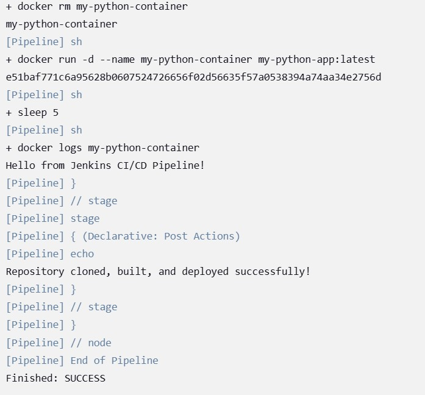

# Day-13 SRE Training

## Topic: Jenkins

Jenkins is an open-source automation server used for Continuous Integration and Continuous Deployment (CI/CD). It automates building, testing, and deploying applications, making development faster and more reliable.

## Why Jenkins?
- **Automation**: Eliminates manual intervention in the CI/CD pipeline.
- **Integration**: Supports various tools like Git, Docker, Kubernetes, and AWS.
- **Customization**: Offers thousands of plugins to extend functionality.
- **Scalability**: Can be distributed across multiple machines for efficient builds.

### Starting Jenkins
```bash
sudo systemctl start jenkins
```
Starts the Jenkins service using `systemd` with root privileges, making it available for use.

## JenkinsFile
```groovy
pipeline {
    agent any
    environment {
        DOCKER_IMAGE = 'my-python-project:latest'
    }
    stages {
        stage('Checkout') {
            steps {
                dir('/home/user/my_python_project') {
                    git branch: 'main', url: 'file:///home/user/my_python_project'
                }
            }
        }
        stage('Build Wheel') {
            steps {
                sh 'pip install build'
                sh 'python -m build --wheel'
            }
        }
        stage('Test') {
            steps {
                sh 'pip install pytest'
                sh 'pytest tests/'
            }
        }
        stage('Build Docker Image') {
            steps {
                sh 'docker build -t my-python-project:latest .'
            }
        }
        stage('Deploy') {
            steps {
                sh 'docker stop my-python-container || true'
                sh 'docker rm my-python-container || true'
                sh 'docker run -d --name my-python-container my-python-project:latest'
            }
        }
    }
    post {
        success {
            echo 'Pipeline completed successfully!'
        }
        failure {
            echo 'Pipeline failed!'
        }
    }
}
```

## Breakdown of the Pipeline
1. **agent any** → Runs on any available Jenkins agent.
2. **environment** → Defines a variable `DOCKER_IMAGE` for the Docker image name.
3. **stages** → Contains multiple stages:
   - **Checkout** → Pulls the latest code from a local Git repository.
   - **Build Wheel** → Installs `build` and creates a Python wheel package.
   - **Test** → Installs `pytest` and runs tests in the `tests/` directory.
   - **Build Docker Image** → Builds a new Docker image, replacing the previous one if the name is the same.
   - **Deploy** → Stops and removes any existing container, then runs a new container.
4. **post** → Executes actions after the pipeline:
   - **success** → Prints a success message.
   - **failure** → Prints a failure message.

## SSH Authentication Issue in Jenkins
While running the Jenkins pipeline, the `git clone` step failed due to SSH authentication issues. The Jenkins user was unable to authenticate with GitHub using SSH keys.

### Fixing SSH Authentication
```bash
# Copy the private key to the Jenkins SSH directory
sudo cp id_ed25519 /var/lib/jenkins/.ssh/

# Copy the public key to the same directory
sudo cp id_ed25519.pub /var/lib/jenkins/.ssh/

# Change ownership of the public key to Jenkins
sudo chown jenkins:jenkins /var/lib/jenkins/.ssh/id_ed25519.pub

# Set correct permissions for the private and public keys
sudo chmod 600 /var/lib/jenkins/.ssh/id_ed25519
sudo chmod 644 /var/lib/jenkins/.ssh/id_ed25519.pub

# Switch to the Jenkins user and test SSH authentication
sudo su - jenkins
ssh -T git@github.com
```
### Expected Output
```
Hi Veena1700! You've successfully authenticated, but GitHub does not provide shell access.
```
This confirms successful SSH authentication.


