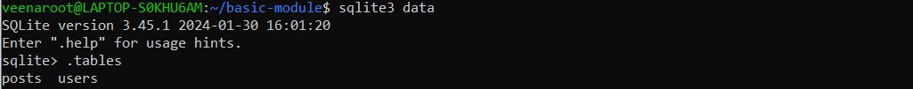
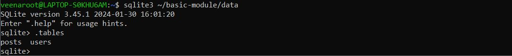

# NumPy: A Comprehensive Overview

## What is NumPy?
NumPy (Numerical Python) is an open-source library in Python used for numerical computing. It provides support for large, multi-dimensional arrays and matrices, along with a collection of mathematical functions to operate on these data structures efficiently.

## Why Use NumPy?
- **Performance**: NumPy arrays (ndarrays) are more memory-efficient and faster than Python lists due to optimized C-based implementations.
- **Mathematical Operations**: It supports a wide range of mathematical operations such as linear algebra, Fourier transforms, and statistical calculations.
- **Ease of Use**: NumPy integrates seamlessly with other scientific computing libraries like SciPy, Pandas, and Matplotlib.
- **Broadcasting**: Allows element-wise operations on arrays of different shapes without explicit looping.

## Real-Life Applications of NumPy
### 1. **Data Science & Machine Learning**
   - Used for data preprocessing, handling large datasets, and performing mathematical operations in frameworks like TensorFlow and Scikit-learn.

### 2. **Image Processing**
   - NumPy arrays store image pixel data, enabling operations like image transformations, filtering, and enhancements.

### 3. **Finance & Stock Market Analysis**
   - Used for analyzing stock price trends, risk calculations, and performing statistical modeling on financial data.

### 4. **Scientific Computing & Research**
   - Essential in physics, chemistry, and biology for simulating experiments, analyzing results, and solving differential equations.

### 5. **Robotics & AI**
   - Helps in sensor data processing, path planning, and optimization algorithms.

### 6. **Big Data Processing**
   - Efficiently processes large-scale numerical data, making it crucial for analytics and simulations.

## How to Use NumPy?
### Installation:
```sh
pip install numpy
```

## NumPy Functionalities & Code Explanation

### 1. Creating Arrays
```python
import numpy as np

# Create a 1D and 2D array
arr = np.array([1, 2, 3, 4, 5])
arr_2d = np.array([[1, 2, 3], [4, 5, 6]])
print(arr)
print(arr_2d)
```
- `np.array()` is used to create one-dimensional and two-dimensional arrays.

### 2. Creating Special Arrays
```python
# Create an array with random numbers
arr_random = np.random.rand(3, 4)
zeros_array = np.zeros((3, 4))
ones_array = np.ones((3, 4))
full_array = np.full((3, 4), 10)

print(arr_random)
print(zeros_array)
print(ones_array)
print(full_array)
```
- `np.random.rand()` generates random numbers.
- `np.zeros()` and `np.ones()` create arrays filled with zeros and ones.
- `np.full()` initializes an array with a constant value.

### 3. Generating Sequences
```python
# Create an array with a range of numbers
arr_range = np.arange(10, 20, 0.5)
print(arr_range)
```
- `np.arange(start, stop, step)` generates sequences.

### 4. Matrix Operations
```python
# Matrix operations
matrix_1 = np.array([[1, 2, 3], [4, 5, 6]])
matrix_2 = np.array([[1, 2, 3], [4, 5, 6]])

matrix_addition = matrix_1 + matrix_2
matrix_subtraction = matrix_1 - matrix_2
matrix_multiplication = matrix_1 * matrix_2
matrix_division = matrix_1 / matrix_2
matrix_power = matrix_1 ** matrix_2
matrix_transpose = matrix_1.T
matrix_dot_product = np.dot(matrix_1, matrix_2.T)

print(matrix_addition)
print(matrix_subtraction)
print(matrix_multiplication)
print(matrix_division)
print(matrix_power)
print(matrix_transpose)
print(matrix_dot_product)
```
- Performs element-wise addition, subtraction, multiplication, division, and power operations.
- `np.dot()` computes the dot product.
- `.T` transposes a matrix.

### 5. Statistical Operations
```python
# Statistical operations
arr_mean = np.mean(arr)
arr_median = np.median(arr)
arr_std = np.std(arr)
arr_var = np.var(arr)

print(arr_mean)
print(arr_median)
print(arr_std)
print(arr_var)
```
- `np.mean()`, `np.median()`, `np.std()`, and `np.var()` compute statistical measures.

# Pandas: A Comprehensive Overview

## What is Pandas?
Pandas is an open-source Python library that provides powerful data structures for data analysis and manipulation. It is built on top of NumPy and is widely used for handling structured data efficiently.

## Why Use Pandas?
- **Easy Data Handling**: Pandas simplifies data manipulation with DataFrames and Series.
- **Efficient Data Processing**: Optimized for performance, allowing handling of large datasets.
- **Data Cleaning & Transformation**: Supports handling missing data, merging, grouping, and reshaping.
- **Built-in Data Analysis**: Provides functions for statistical and mathematical operations.
- **Integration with Other Libraries**: Works seamlessly with NumPy, Matplotlib, and SciPy.

## Real-Life Applications of Pandas
### 1. **Data Science & Machine Learning**
   - Used in preprocessing datasets before training ML models.

### 2. **Financial Analysis**
   - Analyzing and processing large datasets of stock prices and financial records.

### 3. **Business Analytics**
   - Handling sales reports, customer segmentation, and revenue forecasting.

### 4. **Healthcare & Medical Data**
   - Used for patient record management and clinical data analysis.

### 5. **Big Data Processing**
   - Efficiently processes structured data for decision-making.

## How to Use Pandas?
### Installation:
```sh
pip install pandas
```

## Pandas Functionalities

### 1. Creating a Series
```python
import pandas as pd

series = pd.Series([1, 2, 3, 4, 5])
print(series)
```
- `pd.Series()` creates a one-dimensional labeled array.

```python
series_2 = pd.Series([1, 2, 3, 4, 5], index=['a', 'b', 'c', 'd', 'e'])
print(series_2)
```
- Custom index labels can be assigned to a Series.

### 2. Creating a DataFrame
```python
data = {
    'Name': ['John', 'Jane', 'Jim', 'Jill'],
    'Age': [20, 21, 22, 23],
    'City': ['New York', 'Los Angeles', 'Chicago', 'Houston']
}

df = pd.DataFrame(data)
print(df)
```
- `pd.DataFrame()` creates a tabular structure with labeled columns.

### 3. Reading Data from a CSV File
```python
df_csv = pd.read_csv('src/basic_module/numerical/data.csv')
print(df_csv)
```
- `pd.read_csv()` loads structured data from a CSV file into a DataFrame.

### 4. Concatenating DataFrames
```python
df_csv = pd.concat([df_csv, df_csv])
print(df_csv)
```
- `pd.concat()` combines multiple DataFrames.

### 5. Adding a New Row
```python
next_idx = len(df_csv)
print(next_idx)
df_csv.loc[next_idx] = ['Ashfdkjshn', 20, 'New York', 75000, '2024-02-15']
print(df_csv)
```
- `.loc[]` is used to add a new row with specific values.

### 6. Saving Data to a CSV File
```python
df_csv.to_csv('df_csv.csv', index=False)
```
- `.to_csv()` exports the DataFrame to a CSV file.

Pandas is an essential tool for working with structured data efficiently, making it indispensable for data analysts and scientists.

# SQLAlchemy: An Overview

## What is SQLAlchemy?
SQLAlchemy is a Python SQL toolkit and Object Relational Mapper (ORM) that provides a set of high-level API functions to interact with relational databases. It supports both SQL execution and ORM features.

## Why Use SQLAlchemy?
- **Flexibility**: Supports raw SQL queries and ORM-based interaction.
- **Efficiency**: Provides connection pooling and optimized queries.
- **Portability**: Works with multiple databases like SQLite, MySQL, PostgreSQL, and more.
- **Declarative Syntax**: Helps define database schemas using Python classes.
- **Transaction Management**: Ensures safe and consistent database operations.

## Key Concepts
### What is ORM (Object Relational Mapping)?
ORM is a technique that allows developers to interact with a database using Python objects instead of writing raw SQL queries. It maps database tables to Python classes, making it easier to work with data in an object-oriented manner.

## Basic SQLAlchemy Keywords & Concepts

| Keyword        | Description |
|---------------|-------------|
| `create_engine()` | Establishes a connection to the database. |
| `MetaData`    | Holds metadata of the database schema. |
| `Table`       | Represents a database table. |
| `Column`      | Defines a column in a table. |
| `Integer, String` | Data types for columns. |
| `ForeignKey`  | Creates relationships between tables. |
| `insert()`    | Inserts new records into a table. |
| `select()`    | Retrieves records from a table. |
| `execute()`   | Executes a SQL statement. |
| `commit()`    | Saves transactions to the database. |

## Code Breakdown

### 1. Creating an Engine
```python
from sqlalchemy import create_engine

engine = create_engine('sqlite:///data', echo=True)
```
- `create_engine('sqlite:///data')` creates an SQLite database named `data`.
- `echo=True` prints SQL commands executed.

### 2. Defining Tables
```python
from sqlalchemy import MetaData, Table, Column, Integer, String, ForeignKey

metadata = MetaData()

users = Table('users', metadata,
    Column('id', Integer, primary_key=True),
    Column('name', String),
    Column('age', Integer),
    Column('city', String),
)

posts = Table('posts', metadata,
    Column('id', Integer, primary_key=True),
    Column('title', String),
    Column('content', String),
    Column('user_id', Integer, ForeignKey('users.id')),
)
```
- `MetaData()` holds the schema.
- `Table('users', metadata, ...)` defines a `users` table with columns for `id`, `name`, `age`, and `city`.
- `Table('posts', metadata, ...)` defines a `posts` table with a `ForeignKey` linking to `users.id`.

### 3. Creating Tables in the Database
```python
metadata.create_all(engine)
```
- This creates the defined tables in the database if they do not already exist.

### 4. Inserting Data
```python
from sqlalchemy import insert

with engine.connect() as con:
    insert_stmt = insert(users).values(name='John', age=20, city='New York')
    result = con.execute(insert_stmt)
    print(result.rowcount)
```
- `insert(users).values(...)` adds a new user.
- `execute(insert_stmt)` runs the SQL command.
- `rowcount` prints the number of rows inserted.

### 5. Inserting Data into Posts Table
```python
insert_stmt = insert(posts).values(title='Post 1', content='Content 1', user_id=1)
result = con.execute(insert_stmt)
print(result.rowcount)
```
- A post is added with `title`, `content`, and `user_id` linking to the `users` table.

### 6. Committing Transactions
```python
con.commit()
```
- Saves the changes to the database.

### 7. Retrieving Data
```python
from sqlalchemy import select

select_stmt = select(users)
result = con.execute(select_stmt)
for row in result:
    print(row)
```
- `select(users)` retrieves all users.
- `execute(select_stmt)` runs the query.
- The result is iterated and printed.

### 8. Selecting Data from Posts Table
```python
select_stmt = select(posts)
result = con.execute(select_stmt)
for row in result:
    print(row)
```
- Retrieves all posts in the `posts` table.

- **SQLAlchemy provides both SQL execution and ORM capabilities**.
- **This script creates tables, inserts data, and retrieves records**.
- **Using SQLAlchemy ensures efficient and structured database management in Python**.


# Accessing SQLite Database from Different Directories

## Scenario 1: Accessing SQLite Database from the Project Directory

When inside the `basic-module` directory, running the following command:

```sh
sqlite3 data
```


### Explanation:
- `sqlite3 data` opens the `data` SQLite database file located in the current directory (`basic-module`).
- The `.tables` command lists the tables present in the database.
- The output shows `posts` and `users`, meaning these tables were successfully created in `data`.

## Scenario 2: Accessing SQLite Database from Home Directory

When running the following command from the home directory:

```sh
sqlite3 ~/basic-module/data
```


### Explanation:
- `sqlite3 ~/basic-module/data` explicitly opens the `data` file located in `basic-module` from the home directory (`~` represents the home directory).
- The `.tables` command again lists `posts` and `users`, confirming the same database is accessed.
