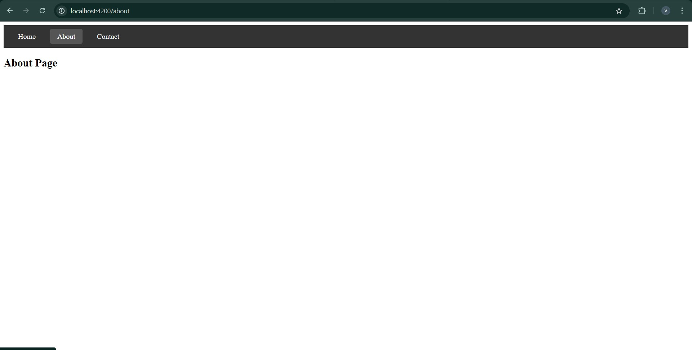

# Angular: A Comprehensive Overview

## What is Angular?

Angular is a powerful, open-source, front-end web application framework developed by Google. It's designed to build dynamic, single-page applications (SPAs) efficiently and effectively. Angular is built on TypeScript, a superset of JavaScript, which provides static typing, improved code maintainability, and enhanced developer tooling.

## Why Angular?

Angular offers several advantages for building complex web applications:

* **Component-based architecture:** Angular promotes a modular and reusable component-based structure, making applications easier to develop, test, and maintain.
* **TypeScript:** Using TypeScript enhances code quality by providing static typing, catching errors early, and improving code readability.
* **Two-way data binding:** Angular's two-way data binding simplifies the synchronization between the model and the view, reducing boilerplate code.
* **Dependency injection:** Dependency injection makes it easier to manage dependencies and test components.
* **Rich ecosystem:** Angular has a vast ecosystem of libraries, tools, and community support.
* **Powerful CLI:** The Angular CLI simplifies development tasks, such as creating components, services, and building applications.
* **Cross-platform capabilities:** Angular can be used to build web, mobile (using Ionic or NativeScript), and desktop applications (using Electron).

## How Angular Works

Angular operates on the following core concepts:

1.  **Components:** The building blocks of an Angular application. Each component encapsulates a part of the user interface and its associated logic.
2.  **Templates:** HTML-based views that define the structure and layout of components.
3.  **Directives:** Extend HTML's functionality by adding behavior to elements.
4.  **Services:** Reusable classes that provide functionality to components, such as data fetching or logging.
5.  **Modules:** Organize components, services, and other Angular elements into logical units.
6.  **Routing:** Enables navigation between different views in a single-page application.
7.  **Dependency Injection:** A design pattern that allows components to receive their dependencies from external sources.

**The Angular Lifecycle:**

Angular components go through a lifecycle, which includes:

* **Creation:** The component is initialized.
* **Change detection:** Angular detects and updates the view when data changes.
* **Destruction:** The component is removed from the DOM.

## Installation

1.  **Install Node.js and npm:** Angular requires Node.js and npm (Node Package Manager). Download and install them from the official Node.js website.
2.  **Install Angular CLI:** The Angular CLI simplifies Angular development. Install it globally using npm:

    ```bash
    npm install -g @angular/cli
    ```

3.  **Create a new Angular project:**

    ```bash
    ng new my-angular-app
    cd my-angular-app
    ```

4.  **Run the application:**

    ```bash
    ng serve --open
    ```

## Entry Point and Code Flow

**Entry Point:**

The entry point of an Angular application is `main.ts` located in the `src` folder.

**What Happens After the Entry Point:**

1.  **`main.ts`:**
    * Imports the `platformBrowserDynamic` function and the `AppModule`.
    * Calls `platformBrowserDynamic().bootstrapModule(AppModule)` to bootstrap the application.
2.  **`AppModule` (`app.module.ts`):**
    * Defines the root module of the application.
    * Declares the root component (`AppComponent`) and other components, directives, and services.
    * Imports necessary modules, such as `BrowserModule`.
    * Specifies the `AppComponent` as the bootstrap component.
3.  **`AppComponent` (`app.component.ts`):**
    * The root component that is loaded when the application starts.
    * Contains the application's main logic and template.
4.  **`index.html`:**
    * Contains the `<app-root>` tag, which is a placeholder for the `AppComponent`.
    * Angular replaces the `<app-root>` tag with the rendered `AppComponent` template.
5.  **Component Rendering:**
    * Angular compiles the components templates into executable code.
    * Angular then renders the html on the page, and manages the data flow between typescript code and the html template.
6.  **Routing (if configured):**
    * If routing is configured, the `RouterModule` handles navigation between different components based on the URL.
    * The router loads the appropriate component and renders it in the designated router outlet.
7.  **Change Detection:**
    * Angular's change detection mechanism monitors data changes and updates the view accordingly.
    * When data changes, Angular updates the DOM to reflect the new state.
8.  **Event Handling:**
    * Angular handles user events (e.g., clicks, keyboard input) using event bindings.
    * Event handlers in the component's TypeScript code are executed.
9.  **Services:**
    * Services provide reusable functionality to components.
    * Components can inject services using dependency injection.
    * Services can fetch data from APIs, perform calculations, or manage application state.

In essence, Angular bootstraps the `AppModule`, which then loads the `AppComponent`. The `AppComponent` and its child components are rendered in the browser, and Angular manages the data flow and user interactions.

# Color Changer Component in Angular

## Overview
This Angular component allows users to change the color of a square box by clicking on different buttons. Each button represents a color, and clicking it updates the background color of the box.

## Steps to Implement

### 1. Generate the Component
Run the following command to create a new component:
```sh
ng generate component color-changer
```

### 2. Update the Files

#### **color-changer.component.ts**
```typescript
import { Component } from '@angular/core';

@Component({
  selector: 'app-color-changer',
  templateUrl: './color-changer.component.html',
  styleUrls: ['./color-changer.component.css']
})
export class ColorChangerComponent {
  selectedColor: string = 'purple'; // Default color

  changeColor(color: string) {
    this.selectedColor = color; // Updates color on button click
  }
}
```

#### **color-changer.component.html**
```html
<div class="container">
  <h1>Color Change App</h1>
  <p>This is a Color Change App</p>
  
  <div class="color-box">
    <h2>Color Change</h2>
    <div class="square" [ngStyle]="{'background-color': selectedColor}"></div>
    
    <div class="buttons">
      <button (click)="changeColor('red')" class="red">Red</button>
      <button (click)="changeColor('blue')" class="blue">Blue</button>
      <button (click)="changeColor('green')" class="green">Green</button>
      <button (click)="changeColor('purple')" class="purple">Purple</button>
    </div>
  </div>
</div>
```

#### **color-changer.component.css**
```css
.container {
  text-align: center;
  font-family: Arial, sans-serif;
}

.color-box {
  border: 1px solid #ccc;
  padding: 20px;
  display: inline-block;
  border-radius: 10px;
}

.square {
  width: 100px;
  height: 100px;
  margin: 10px auto;
  border-radius: 5px;
}

.buttons button {
  margin: 5px;
  padding: 10px 15px;
  border: none;
  color: white;
  cursor: pointer;
  font-size: 16px;
  border-radius: 5px;
}

.red { background-color: red; }
.blue { background-color: blue; }
.green { background-color: green; }
.purple { background-color: purple; }
```

### 3. Use the Component
Add this component to your **app.component.html**:
```html
<app-color-changer></app-color-changer>
```
<div style="text-align: center;">
  
</div>

## Explanation
1. **TypeScript (`color-changer.component.ts`)**
   - Defines the component.
   - Holds a `selectedColor` variable to store the current color.
   - `changeColor(color: string)` updates the `selectedColor` when a button is clicked.

2. **HTML (`color-changer.component.html`)**
   - Displays a box whose background color changes.
   - Uses Angular’s `ngStyle` directive to bind the box’s background color dynamically.
   - Buttons trigger `changeColor()` when clicked.

3. **CSS (`color-changer.component.css`)**
   - Styles the container, box, and buttons.
   - Adds background colors to buttons for better visibility.

# Angular Routing with Home, About, and Contact Components

## Code Implementation

### app.component.ts (Main App Component)
```typescript
import { Component } from '@angular/core';
import { RouterModule } from '@angular/router';

@Component({
  selector: 'app-root',
  standalone: true,
  imports: [RouterModule],
  template: `
    <nav>
      <a routerLink="/">Home</a>
      <a routerLink="/about">About</a>
      <a routerLink="/contact">Contact</a>
    </nav>
    <router-outlet></router-outlet>
  `,
  styles: `
    nav {
      padding: 1rem;
      background: #333;
      margin-bottom: 1rem;
    }
    nav a {
      color: white;
      padding: 0.5rem 1rem;
      text-decoration: none;
      margin-right: 1rem;
    }
    nav a:hover {
      background: #555;
      border-radius: 4px;
    }
  `
})
export class AppComponent {
  title = 'basic-angular-app';
}
```
**Explanation:**
- The `AppComponent` serves as the main entry point of the application.
- It imports `RouterModule` to enable routing.
- The `<nav>` element provides navigation links using `routerLink` to navigate between pages without refreshing.
- `<router-outlet>` is a placeholder that displays the routed component based on the current URL.

<div style="text-align: center;">
  
</div>

### home.component.ts (Home Component)
```typescript
import { Component } from '@angular/core';

@Component({
  selector: 'app-home',
  templateUrl: './home.component.html',
  styleUrls: ['./home.component.css']
})
export class HomeComponent {
}
```
**Explanation:**
- The `HomeComponent` is a simple component that acts as the landing page of the application.
- It has its own HTML and CSS file for structure and styling.

<div style="text-align: center;">
  
</div>

### about.component.ts (About Component)
```typescript
import { Component } from '@angular/core';

@Component({
  selector: 'app-about',
  templateUrl: './about.component.html',
  styleUrls: ['./about.component.css']
})
export class AboutComponent {
}
```
**Explanation:**
- Similar to the `HomeComponent`, the `AboutComponent` displays information about the application.

<div style="text-align: center;">
  
</div>

### contact.component.ts (Contact Component)
```typescript
import { Component } from '@angular/core';

@Component({
  selector: 'app-contact',
  templateUrl: './contact.component.html',
  styleUrls: ['./contact.component.css']
})
export class ContactComponent {
}
```
**Explanation:**
- The `ContactComponent` provides details about how users can get in touch.

### app-routing.module.ts (Routing Configuration)
```typescript
import { NgModule } from '@angular/core';
import { RouterModule, Routes } from '@angular/router';
import { HomeComponent } from './home/home.component';
import { AboutComponent } from './about/about.component';
import { ContactComponent } from './contact/contact.component';

export const routes: Routes = [
  { path: '', component: HomeComponent },
  { path: 'about', component: AboutComponent },
  { path: 'contact', component: ContactComponent },
  { path: '**', redirectTo: '' } // Wildcard route for unknown paths
];
```
**Explanation:**
- Defines an array of routes where each path maps to a component.
- `{ path: '', component: HomeComponent }` sets the home component as the default route.
- `{ path: '**', redirectTo: '' }` redirects any unknown URLs to the home page.

## Navigation Flow
1. The app loads `AppComponent`, displaying the navigation bar.
2. Clicking on "Home", "About", or "Contact" updates the URL and loads the respective component inside `<router-outlet>`.
3. Angular handles navigation without refreshing the page.
4. If an unknown route is entered, the wildcard redirects to home (`/`).


