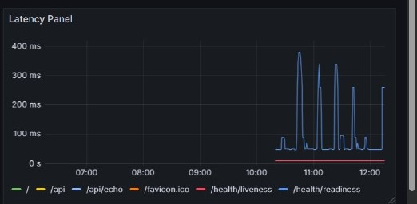

# Lightweight SRE Monitoring Setup

## Features
- **Automated Minikube Setup**: Ensures a clean Minikube environment.
- **Lightweight Flask API**: Includes Prometheus-based monitoring for request count, latency, and errors.
- **Minimal Kubernetes Resource Usage**: Optimized deployment for low-resource environments.
- **Integrated Monitoring Stack**:
  - **Prometheus**: Collects application and infrastructure metrics.
  - **Loki**: Handles log aggregation.
  - **Grafana**: Provides dashboards for real-time monitoring.
- **Load Testing**: Simulates traffic to validate monitoring metrics.

---
## Application Code Breakdown

### **Flask App Overview**
This is a **Flask-based API** designed for monitoring and observability. It includes endpoints for:
- **Fetching users (`/api/users`)** - Simulates a database query with variable latency. Returns a small list of users:
  ```json
  [
    {"id": 1, "name": "Alice", "email": "alice@example.com"},
    {"id": 2, "name": "Bob", "email": "bob@example.com"}
  ]
  ```
- **Echoing JSON (`/api/echo`)** - Accepts JSON input and returns it unmodified. Example request:
  ```json
  {"message": "Hello"}
  ```
  Response:
  ```json
  {"message": "Hello"}
  ```
- **Simulating errors (`/api/error`)** - Generates intentional errors based on query parameters:
  - `?type=client` returns a **400 Bad Request**.
  - Default generates a **500 Internal Server Error**.
- **Health Checks (`/health/liveness` and `/health/readiness`)** - Used by Kubernetes probes to check if the app is running and ready.

### **Prometheus Integration**
Prometheus is integrated using the `prometheus_client` library:
- **Metrics Defined:**
  - `REQUEST_COUNT`: Tracks total API requests.
  - `REQUEST_LATENCY`: Measures response time distributions.
  - `ERROR_COUNTER`: Tracks error occurrences.
  - `ACTIVE_REQUESTS`: Monitors active requests in processing.
- **How It Works in Code:**
  - These metrics are defined in `app.py`:
    ```python
    REQUEST_COUNT = Counter(
        'app_request_count', 
        'Application Request Count',
        ['endpoint', 'method', 'http_status']
    )
    REQUEST_LATENCY = Histogram(
        'app_request_latency_seconds', 
        'Application Request Latency',
        ['endpoint', 'method'],
        buckets=[0.01, 0.05, 0.1, 0.5, 1, 2, 5]
    )
    ERROR_COUNTER = Counter(
        'app_error_count',
        'Application Error Count',
        ['error_type', 'endpoint']
    )
    ACTIVE_REQUESTS = Gauge(
        'app_active_requests',
        'Active Requests Currently Being Processed'
    )
    ```
- **Middleware Hooks:**
  - `@app.before_request`: Starts request tracking:
    ```python
    @app.before_request
    def before_request():
        request.start_time = time.time()
        ACTIVE_REQUESTS.inc()
        request.request_id = str(random.randint(1000, 9999))
    ```
  - `@app.after_request`: Logs and updates metrics:
    ```python
    @app.after_request
    def after_request(response):
        ACTIVE_REQUESTS.dec()
        request_time = time.time() - request.start_time
        REQUEST_LATENCY.labels(endpoint=request.path, method=request.method).observe(request_time)
        REQUEST_COUNT.labels(endpoint=request.path, method=request.method, http_status=response.status_code).inc()
        return response
    ```
- **Prometheus Endpoint (`/metrics`)**:
  - Exposes application metrics for Prometheus scraping:
    ```python
    from prometheus_client import make_wsgi_app
    from werkzeug.middleware.dispatcher import DispatcherMiddleware
    app.wsgi_app = DispatcherMiddleware(app.wsgi_app, {'/metrics': make_wsgi_app()})
    ```

### **Loki & Logging Integration**
- **Structured Logging Implementation:**
  - The Flask app uses Python’s `logging` module to structure logs:
    ```python
    import logging
    logging.basicConfig(
        level=logging.INFO,
        format='%(asctime)s [%(levelname)s] %(message)s - request_id=%(request_id)s',
        datefmt='%Y-%m-%d %H:%M:%S'
    )
    ```
- **Error Logging:**
  - Errors are tagged and counted in Prometheus:
    ```python
    if random.random() < 0.02:  # Simulated 2% error rate
        ERROR_COUNTER.labels(error_type="database_error", endpoint="/api/users").inc()
        logging.error("Database error occurred: Failed to retrieve users")
    ```
- **Loki Integration via Promtail:**
  - Promtail collects logs from Kubernetes pods and sends them to Loki.
  - Loki configuration is handled in `loki-values.yaml`.

---
## Kubernetes Monitoring Stack

### **Prometheus Configuration (`prometheus-values.yaml`)**
This defines a **lightweight Prometheus setup**:
```yaml
alertmanager:
  enabled: false
pushgateway:
  enabled: false
nodeExporter:
  enabled: false
server:
  persistentVolume:
    enabled: false
  resources:
    requests:
      cpu: 100m
      memory: 256Mi
    limits:
      cpu: 200m
      memory: 512Mi
```

### **Loki Configuration (`loki-values.yaml`)**
Loki is configured for **log aggregation**:
```yaml
loki:
  persistence:
    enabled: false
  resources:
    requests:
      cpu: 50m
      memory: 128Mi
    limits:
      cpu: 100m
      memory: 256Mi
promtail:
  config:
    snippets:
      pipelineStages:
        - docker: {}
```

---
### Different visulaisations in grafana based on this app
<p align="center">
  
</p><p align="center">
  
</p><p align="center">
  
