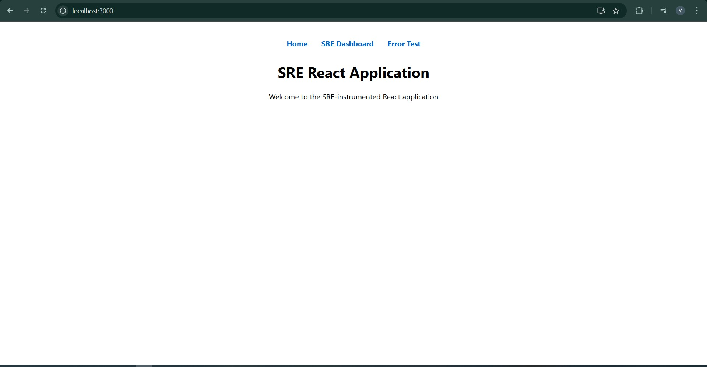

# Detailed Explanation of the React SRE Setup Script

This document explains the complete setup script for a React-based SRE (Site Reliability Engineering) application. The script automates the entire workflow—from setting up dependencies to deploying the application in a Kubernetes environment with monitoring using Prometheus and Grafana.

---

## 1. General Setup

### Directory Definitions
- **Project Directories:**  
  - `PROJECT_ROOT="$HOME/react-sre-project"`  
    The base directory for the entire project.
  - `REACT_APP_DIR="$PROJECT_ROOT/sre-react-app"`  
    Where the React application code is stored.
  - `K8S_DIR="$PROJECT_ROOT/kubernetes"`  
    Contains all Kubernetes configuration files.
  - `MONITORING_DIR="$PROJECT_ROOT/monitoring"`  
    Holds configuration for Prometheus and Grafana.
  - `SCRIPTS_DIR="$PROJECT_ROOT/scripts"`  
    Directory for automation scripts.
---

## 2. Initial Setup

### WSL Environment Check: `check_wsl()`
- **Purpose:**  
  Ensures that the script is being run within a Windows Subsystem for Linux (WSL) environment.
- **Implementation:**  
  Greps the `/proc/version` file for the keyword "Microsoft". If not found, logs an error and exits.
---

## 3. Creating the React Application with SRE Instrumentation

### Creating the React App: `create_react_app()`
- **Purpose:**  
  Bootstraps a new React application.
- **Implementation:**  
  - Uses `npx create-react-app` to create a new React project.
  - Changes into the React application directory.
  - Installs additional dependencies needed for SRE instrumentation, including:
    - `axios` for making HTTP requests.
    - `react-router-dom` for routing.
    - `swr` for data fetching.
    - `@prometheus/client` (or similar) for metrics.
    - `react-error-boundary` for handling UI errors.
    - `@grafana/ui` for potential UI integrations.
    - `history` for navigation management.
  - Logs the successful creation of the React app.
 
  

  

### Adding SRE Instrumentation: `create_react_sre_files()`
- **Purpose:**  
  Adds custom components and services to the React app for monitoring and error handling.
- **Components and Services:**
  - **HealthCheck Component (`HealthCheck.jsx`):**
    - Periodically fetches the `/api/health` endpoint.
    - Displays backend health status, uptime, and dependency statuses.
  - **ErrorBoundary Component (`ErrorBoundary.jsx`):**
    - Catches JavaScript errors in child components.
    - Displays a fallback UI and logs errors via the SRE metrics system.
  - **Metrics Service (`metrics.js`):**
    - **Counter Class:**  
      - Maintains a counter value and sends increment events to the backend.
    - **Gauge Class:**  
      - Tracks a variable value (e.g., memory usage) and sends updates.
    - **Histogram Class:**  
      - Records observations (e.g., page load times) and sends data to the backend.
    - Sends data using `navigator.sendBeacon` to the `/api/metrics` endpoint.
  - **App Component (`App.js`):**
    - Sets up routing for the app (Home, Dashboard, Error Test).
    - Integrates the HealthCheck and ErrorBoundary components.
    - Uses the metrics service to track navigation events and trigger error reporting.
---

## 6. Kubernetes Configuration

### Base Kubernetes Files
- **Namespace (`namespace.yaml`):**  
  Defines a dedicated namespace `react-sre-app` for the application.
  
- **Deployment (`deployment.yaml`):**  
  - Specifies how the React application is deployed:
    - **Replicas:** Default set to 2.
    - **Container Image:** Uses the `react-sre-app:latest` image.
    - **Ports:** Exposes port 3000.
    - **Resource Limits:** Sets CPU and memory limits/requests.
    - **Probes:** Configures readiness and liveness probes using the `/health` endpoint.
    - **Prometheus Annotations:** Adds annotations (`prometheus.io/scrape`, etc.) for metric scraping.
  
- **Service (`service.yaml`):**  
  Exposes the deployment via a ClusterIP service on port 80.
  
- **Ingress (`ingress.yaml`):**  
  Configures external access using an Ingress resource with Nginx, rewriting paths appropriately.
  
- **Kustomization (`kustomization.yaml`):**  
  Lists all the above resources for deployment using Kustomize.

### Overlay Configurations
- **Dev Overlay (`overlays/dev`):**
  - **Replica Count Patch (`replica-count.yaml`):**  
    Reduces the replica count (e.g., to 1) for a development environment.
  - **Resource Limits Patch (`resource-limits.yaml`):**  
    Adjusts resource limits to lower values suitable for development.
  - **Kustomization File:**  
    Applies patches to the base configuration and adds a name prefix (e.g., `dev-`).

- **Prod Overlay (`overlays/prod`):**
  - **Replica Count Patch (`replica-count.yaml`):**  
    Increases the replica count (e.g., to 3) for production.
  - **Resource Limits Patch (`resource-limits.yaml`):**  
    Sets higher resource limits to handle production loads.
  - **Kustomization File:**  
    Applies these patches and adds a name prefix (e.g., `prod-`).

### Dockerfile and Nginx Configuration
- **Dockerfile for React App:**
  - **Build Stage:**  
    Uses a Node.js Alpine image to install dependencies and build the React app.
  - **Production Stage:**  
    Uses an Nginx Alpine image to serve the built application.
  - **Health Check and Metrics:**  
    Copies a custom `nginx.conf` and creates a health check endpoint at `/health` and a metrics endpoint at `/metrics` (which returns mock Prometheus metrics).

- **Nginx Configuration (`nginx.conf`):**
  - Configures Nginx to:
    - Serve static files for the React application.
    - Expose the `/health` endpoint returning a JSON status.
    - Expose the `/metrics` endpoint with sample Prometheus metrics.
    - Define error pages for HTTP 404 and 50x errors.

---

## 7. Monitoring Configuration

### Prometheus Configuration
- **Prometheus YAML (`prometheus.yaml`):**
  - **Global Settings:**  
    Sets scrape interval, evaluation interval, and scrape timeout.
  - **Alerting:**  
    Configures Alertmanager with static configurations.
  - **Scrape Configs:**  
    Defines jobs for scraping metrics from Prometheus itself and the React SRE app (using Kubernetes service discovery and relabeling rules).
  
- **Alert Rules (`alert-rules.yaml`):**
  - Specifies alerts for:
    - High error rate: Triggers if HTTP 5xx errors exceed 5% of total requests.
    - High response time: Alerts when the 95th percentile response time exceeds 1 second.
    - High memory usage: Alerts when memory usage exceeds 85% of the limit.

- **Kubernetes ConfigMap:**  
  Creates a ConfigMap (`prometheus-config`) that contains the Prometheus configuration and alert rules, which is mounted into the Prometheus pod.

### Grafana Configuration
- **Datasource Configuration (`datasource.yaml`):**  
  Configures Prometheus as the default data source in Grafana.
  
- **Dashboard Configuration (`react-sre-dashboard.json`):**  
  A prebuilt dashboard JSON file that defines various panels to visualize:
  - HTTP request rates.
  - Response times (using histogram quantiles).
  - Error rates, memory usage, CPU usage.
  - Pod availability.
  
- **Kubernetes Deployment for Grafana:**  
  Deploys Grafana in the `monitoring` namespace using a ConfigMap to provision datasources and dashboards. A Service is defined to expose Grafana on port 3000.

---

## Conclusion

This setup script automates the complete workflow for a React-based SRE application:
- **Environment Preparation:**  
  Installing system dependencies, setting up Python virtual environments, and configuring Node.js and Kubernetes tools.
- **Application Build and Instrumentation:**  
  Creating a React application with integrated monitoring components (health checks, error boundaries, and custom metrics).
- **Kubernetes Deployment:**  
  Using base YAML files and environment-specific overlays (dev and prod) to deploy the application.
- **Monitoring Setup:**  
  Configuring Prometheus to scrape metrics and Grafana to visualize them.
- **Automation Scripts:**  
  Providing scripts to control Minikube and deploy the application reliably.

This detailed explanation should help you understand how each part of the code contributes to the overall setup and operation of the React SRE application.
