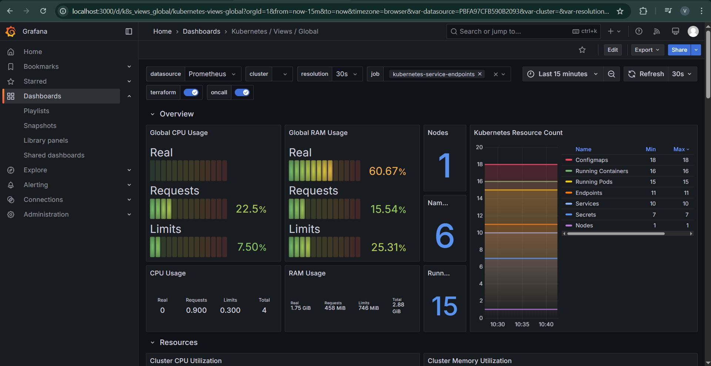

# Exporting and Importing Grafana Dashboard as JSON  

## 1. Export Grafana Dashboard as JSON  

### Steps to Export:  
1. **Open the Dashboard**  
   - Navigate to your **Grafana UI** and open the dashboard you want to export.  

2. **Open Dashboard Settings**  
   - Click on the **Gear icon** in the top right corner to open the **Dashboard settings**.

3. **Select ‘JSON Model’**  
   - In the left panel, click on **JSON Model**.

4. **Copy or Save the JSON**  
   - You will see the **JSON representation** of the dashboard.  
   - Click **Copy to Clipboard** or **Download JSON**.

---

## 2. Import the Dashboard JSON into Grafana  

### Steps to Import:  
1. **Go to Grafana Home**  
   - Click on the **Grafana logo** in the top left corner to go to the home screen.

2. **Click on ‘Import’**  
   - In the left-hand menu, navigate to **Dashboards → Import**.

3. **Upload JSON File or Paste JSON**  
   - You can either:  
     - **Upload the JSON file** you downloaded earlier.  
     - **Paste the copied JSON** into the text box.

4. **Select Data Source**  
   - Choose the appropriate **data source** (e.g., Prometheus, Loki, MySQL).

5. **Click ‘Import’**  
   - The dashboard will be imported and available in your Grafana dashboards.

---

## Access Grafana
  1. Ensure Grafana is running:
     ```bash
     kubectl port-forward svc/grafana -n monitoring 3000:80
     ```
  2. Open **http://localhost:3000** in your browser.  
  3. Log in with:  
     - **Username:** admin  
     - **Password:** admin  
  
  ## Create a New Dashboard  
  1. Click the **"+" icon** on the left sidebar.  
  2. Select **"Dashboard"** → **"Add a new panel"**.  
  
  ## Configure a Logs Panel  
  1. Select **"Loki"** as the data source.  
  2. Enter the query:  
     ```
     {namespace="sample-app"}
     ```  
  3. Choose **"Logs"** visualization.  
  4. Set panel title: **"Application Logs"** → Enable **"Show time"**.  
  5. Click **"Apply"** to save.

<p align="center">
  
</p>
  
  ## Add an Error Logs Panel  
  1. Click **"Add panel"** → **Select Loki**.  
  2. Use this query to filter error logs:  
     ```
     { namespace="sample-app" } |= "ERROR"
     ```  
  3. Configure:  
     - **Title:** "Error Logs"  
     - Enable **"Show labels"**  
  4. Click **"Apply"**.

<p align="center">
  
</p>
  
  ## Add a CPU Usage Metrics Panel  
  1. Click **"Add panel"** → **Select Prometheus**.  
  2. Enter the query:  
     ```
     sum(rate(container_cpu_usage_seconds_total{namespace="sample-app"}[5m])) by (pod)
     ```  
  3. Select **"Time series"** visualization.  
  4. Set title: **"CPU Usage by Pod"** → Configure legend & unit as **percent**.  
  5. Click **"Apply"**.

<p align="center">
  
</p>
  
  ## Add a Log Volume Panel  
  1. Click **"Add panel"** → **Select Loki**.  
  2. Change query type to **Instant**.  
  3. Enter:  
     ```
     sum(count_over_time({namespace="sample-app"}[5m])) by (pod_name)
     ```  
  4. Choose **"Time series"** → Set title to **"Log Volume by Pod"**.  
  5. Click **"Apply"**.

<p align="center">
  
</p>
  
  ## Arrange and Resize Panels  
  1. Drag panels to reposition.  
  2. Resize by dragging panel corners.  
  3. Organize metrics logically.

<p align="center">
  
</p>

## 3. Viewing the Imported Dashboard  
- After importing, navigate to **Dashboards → Manage** to find your dashboard.  
- Click on the imported dashboard to start monitoring your data.

---

<p align="center">
  
</p>
