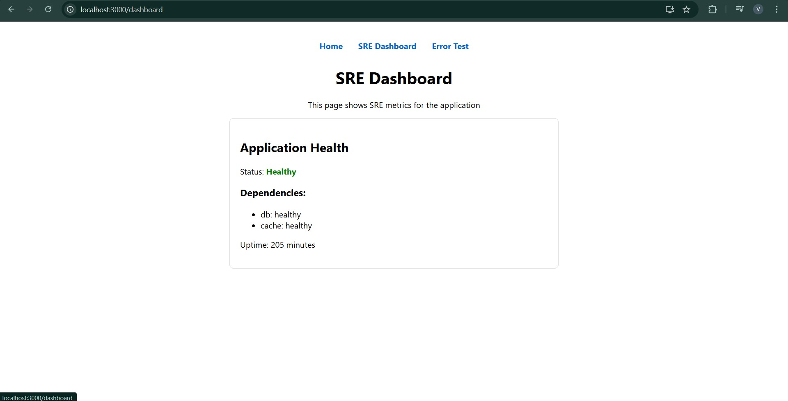
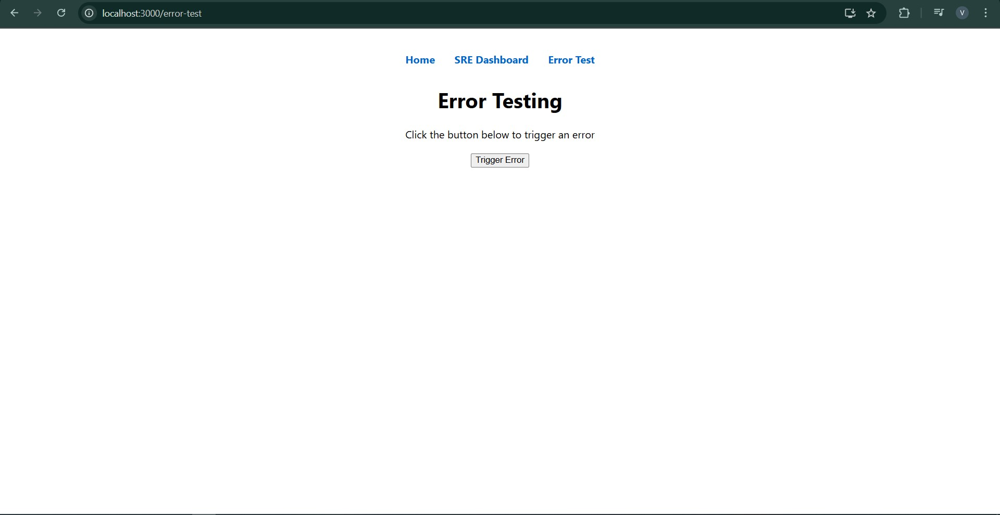
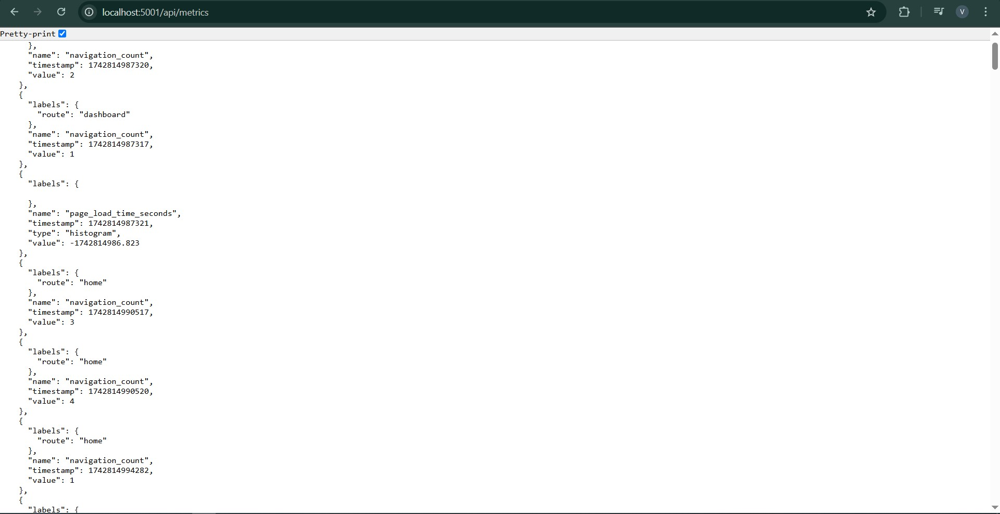
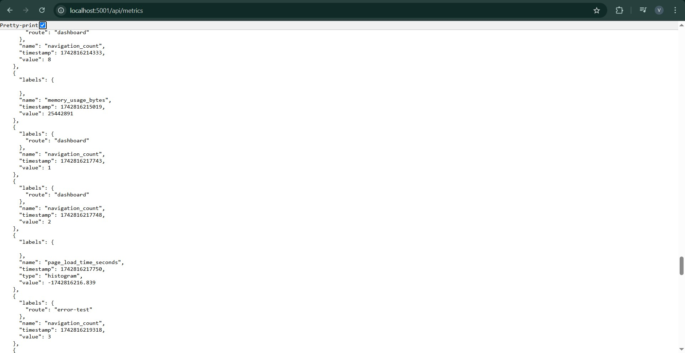

# Detailed Explanation of the Integration with Flask Backend and Metrics Collection

This document explains how the React SRE application was modified to integrate with a Flask backend. Originally, the frontend’s `metrics.js` was sending POST requests to a non-existent backend, which caused errors. A simple Flask backend was added to resolve this issue. Additionally, this document explains the updated `metrics.js` file in detail.

---

## 1. Overview

- **Problem:**  
  The frontend was trying to send metrics data to a backend endpoint that did not exist, leading to errors.

- **Solution:**  
  A simple Flask backend application was implemented to receive the metrics and provide health check and Prometheus scraping endpoints. The React application's `metrics.js` file was updated to send POST requests to this backend.

---

## 2. The Flask Backend Application

### Key Responsibilities

1. **Receive Metrics:**  
   The backend provides an endpoint (`/api/metrics`) that accepts POST requests containing metrics data (e.g., page load time, memory usage, error counts).

2. **Health Check:**  
   It provides an endpoint (`/api/health`) that returns the current health status of the backend and its dependencies.

3. **Prometheus Metrics Exposure:**  
   The backend exposes all collected metrics on the `/metrics` endpoint in a format that Prometheus can scrape.
   
<p align="center">
  
  
</p>

### Code Walkthrough

#### Flask Application Code

```python
from flask import Flask, jsonify, request, Response
from urllib.parse import quote as url_quote
from flask_cors import CORS
from prometheus_client import Counter, Gauge, Histogram, generate_latest, CONTENT_TYPE_LATEST

app = Flask(__name__)
CORS(app)

REQUEST_COUNT = Counter('http_requests_total', 'Total HTTP Requests', ['method', 'endpoint'])
RECEIVED_METRICS = Counter('received_metrics_total', 'Total Metrics Received')
MEMORY_USAGE = Gauge('memory_usage_bytes', 'Memory Usage in Bytes')
PAGE_LOAD_TIME = Histogram('page_load_time_seconds', 'Time Taken to Load the Page', buckets=[0.1, 0.5, 1, 2, 5, 10])

@app.route('/')  
def home():
    return "Welcome to the Backend API!", 200

@app.route('/api/health', methods=['GET'])
def health_check():
    return jsonify({
        "status": "Healthy",
        "uptime": 12345,
        "dependencies": [
            {"name": "db", "status": "healthy"},
            {"name": "cache", "status": "healthy"}
        ]
    })

metrics_storage = []

@app.route('/api/metrics', methods=['POST'])
def collect_metrics():
    REQUEST_COUNT.labels(method="POST", endpoint="/api/metrics").inc()
    if not request.is_json:
        return jsonify({"error": "Unsupported Media Type, expecting JSON"}), 415

    data = request.get_json()
    metrics_storage.append(data)
    RECEIVED_METRICS.inc()
    if "memory_usage_bytes" in data:
        MEMORY_USAGE.set(data["memory_usage_bytes"])
    if "page_load_time_seconds" in data:
        PAGE_LOAD_TIME.observe(data["page_load_time_seconds"])
    print("Received Metrics:", data)
    return jsonify({"message": "Metrics received"}), 200

@app.route('/api/metrics', methods=['GET'])
def get_metrics():
    REQUEST_COUNT.labels(method="GET", endpoint="/api/metrics").inc()
    return jsonify({"metrics": metrics_storage}), 200

@app.route('/metrics')
def prometheus_metrics():
    """Expose Prometheus metrics."""
    return Response(generate_latest(), 200, {'Content-Type': CONTENT_TYPE_LATEST})

if __name__ == "__main__":
    app.run(host='0.0.0.0', port=5001)
```
<p align="center">
  
  
</p>

### Explanation

- **Home (`/`)**: Returns a simple welcome message.
- **Health Check (`/api/health`)**: Returns a JSON object with:
  - "status": "Healthy"
  - Uptime (a fixed value in this case)
  - Dependency statuses (e.g., database and cache)
- **Metrics Collection (`/api/metrics` POST)**:
  - Checks if the request is JSON.
  - Increments a counter for received POST requests.
  - Stores the received data in an in-memory list (`metrics_storage`).
  - Updates specific Prometheus metrics if keys like `memory_usage_bytes` or `page_load_time_seconds` are present.
  - Logs the received data to the console.
- **Get Metrics (`/api/metrics` GET)**: Returns the stored metrics as JSON.
- **Prometheus Endpoint (`/metrics`)**: Exposes all Prometheus metrics using `generate_latest()`.

### Running the Backend

The application is started on host `0.0.0.0` and port `5001`.

