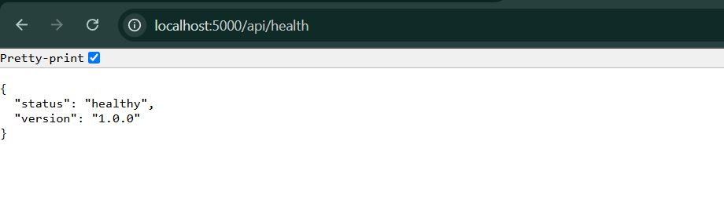
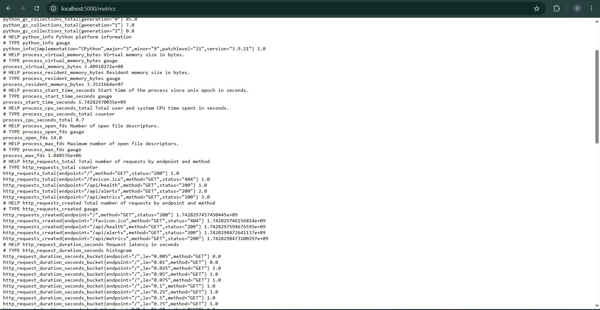
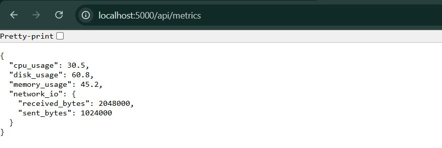
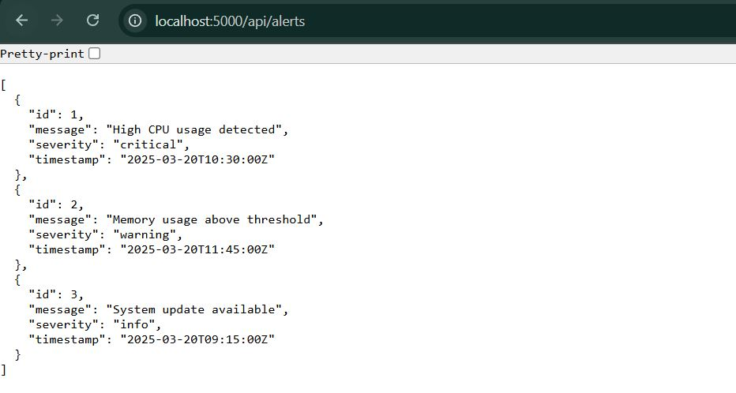
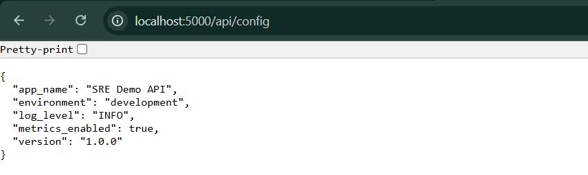
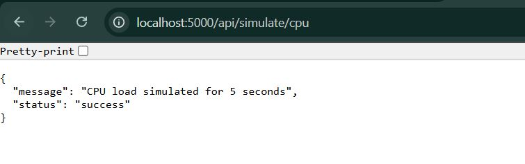
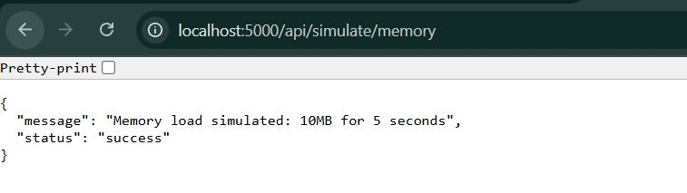
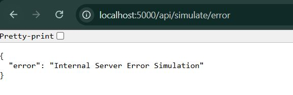
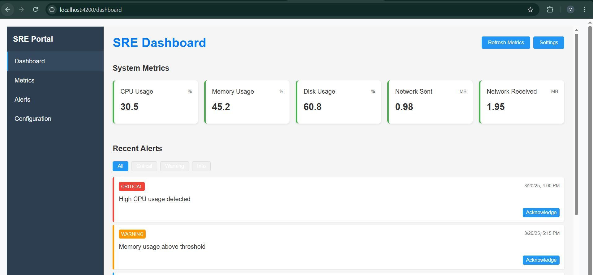
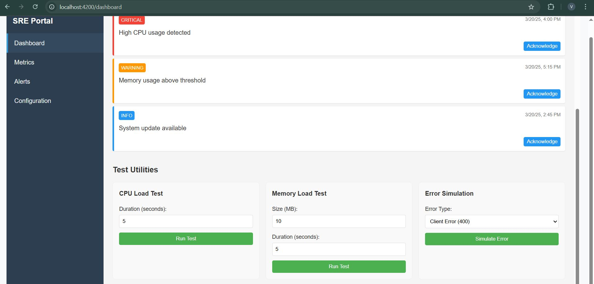

# SRE Application Setup

## Overview
This document explains the setup of Prometheus and Grafana in Kubernetes using Minikube. These monitoring tools help track system performance, collect metrics, and visualize data effectively.

## Minikube Setup
Minikube is a tool that allows running Kubernetes locally. In this setup, Minikube is started to create a local Kubernetes cluster for deploying Prometheus and Grafana.

## Prometheus Setup
Prometheus is a monitoring system that collects and stores metrics from applications and infrastructure.

### Files Used:
1. **prometheus-config.yaml** - Defines the Prometheus configuration, including scrape targets.
2. **prometheus-deployment.yaml** - Deploys Prometheus as a pod in Kubernetes.
3. **prometheus-service.yaml** - Exposes Prometheus as a service for external access.

## Grafana Setup
Grafana is a visualization tool that helps display metrics collected by Prometheus.

### Files Used:
1. **grafana-deployment.yaml** - Deploys Grafana in Kubernetes.
2. **grafana-service.yaml** - Exposes Grafana as a service.
3. **grafana-config.yaml** - Configures Grafana with data sources and dashboards.

## Flask API Setup and Deployment in Kubernetes

## Overview
This setup includes the creation of a Flask API, defining its dependencies, containerizing it using Docker, and deploying it to a Kubernetes cluster. The deployment also integrates Prometheus monitoring for metrics collection.

---

## `app.py` - Flask API Implementation

## Overview
This Flask API serves as a monitoring backend, exposing various system metrics, alerts, and simulation endpoints. It is instrumented with Prometheus for observability and is containerized using Docker for deployment in Kubernetes.

## Code Breakdown

### 1. **Logging Setup**
```python
logging.basicConfig(level=logging.INFO, format='%(asctime)s - %(levelname)s - %(message)s')
logger = logging.getLogger(__name__)
```
- Logs API requests and internal operations with timestamps and severity levels.

### 2. **Flask App Initialization**
```python
app = Flask(__name__)
CORS(app)
```
- Initializes a Flask application and enables CORS for cross-origin resource sharing.

### 3. **Prometheus Metrics**
```python
REQUEST_COUNT = Counter('http_requests_total', 'Total number of requests by endpoint and method', ['method', 'endpoint', 'status'])
REQUEST_LATENCY = Histogram('http_request_duration_seconds', 'Request latency in seconds', ['method', 'endpoint'])
```
- Tracks the number of API requests and their response times.

### 4. **Sample Data**
- **System Metrics**: CPU, memory, disk, and network usage.
- **Alerts**: Stores system alerts with severity levels.

```python
system_metrics = {'cpu_usage': 30.5, 'memory_usage': 45.2, 'disk_usage': 60.8}
alerts = [{'id': 1, 'severity': 'critical', 'message': 'High CPU usage detected'}]
```

### 5. **Middleware for Monitoring**
```python
@app.before_request
def before_request():
    request.start_time = time.time()

@app.after_request
def after_request(response):
    request_latency = time.time() - request.start_time
    REQUEST_LATENCY.labels(request.method, request.path).observe(request_latency)
    REQUEST_COUNT.labels(request.method, request.path, response.status_code).inc()
    return response
```
- Captures request latency and increments Prometheus counters.

### 6. **API Endpoints**

#### a. **Health Check**
```python
@app.route('/api/health')
def health_check():
    return jsonify({'status': 'healthy', 'version': '1.0.0'})
```
- Ensures the API is running properly.

<p align="center">
  
</p>

#### b. **Metrics for Prometheus**
```python
@app.route('/metrics')
def metrics():
    return generate_latest(REGISTRY), 200, {'Content-Type': CONTENT_TYPE_LATEST}
```
- Exposes Prometheus metrics for monitoring.

<p align="center">
  
</p>

#### c. **System Metrics API**
```python
@app.route('/api/metrics')
def get_metrics():
    return jsonify(system_metrics)
```
- Returns CPU, memory, and disk usage statistics.

<p align="center">
  
</p>

#### d. **Alerts API**
```python
@app.route('/api/alerts')
def get_alerts():
    return jsonify(alerts)
```
- Returns a list of system alerts.

<p align="center">
  
</p>

#### e. **Configuration API**
```python
@app.route('/api/config')
def get_config():
    config = {'app_name': 'SRE Demo API', 'environment': os.environ.get('ENVIRONMENT', 'development')}
    return jsonify(config)
```
- Returns API configuration details.

<p align="center">
  
</p>

#### f. **Simulated CPU Load**
```python
@app.route('/api/simulate/cpu')
def simulate_cpu_load():
    duration = int(request.args.get('duration', 5))
    start_time = time.time()
    while time.time() - start_time < duration:
        _ = [i**2 for i in range(10000)]
    return jsonify({'message': f'CPU load simulated for {duration} seconds'})
```
- Simulates high CPU usage for testing purposes.

<p align="center">
  
</p>

#### g. **Simulated Memory Load**
```python
@app.route('/api/simulate/memory')
def simulate_memory_load():
    size_mb = int(request.args.get('size_mb', 10))
    duration = int(request.args.get('duration', 5))
    data = bytearray(size_mb * 1024 * 1024)
    time.sleep(duration)
    return jsonify({'message': f'Memory load simulated: {size_mb}MB for {duration} seconds'})
```
- Simulates high memory consumption.

<p align="center">
  
</p>

#### h. **Simulated Error Responses**
```python
@app.route('/api/simulate/error')
def simulate_error():
    error_type = request.args.get('type', 'server')
    if error_type == 'client':
        return jsonify({'error': 'Bad Request Simulation'}), 400
    else:
        return jsonify({'error': 'Internal Server Error Simulation'}), 500
```
- Generates test errors to simulate server failures.

<p align="center">
  
</p>

### 7. **Application Startup**
```python
if __name__ == '__main__':
    port = int(os.environ.get('PORT', 5000))
    debug_mode = os.environ.get('ENVIRONMENT', 'development') == 'development'
    app.run(host='0.0.0.0', port=port, debug=debug_mode)
```
- Starts the Flask API on the specified port with debug mode based on the environment setting.

---

## `Dockerfile` - Containerizing the Flask API
- Uses `python:3.11-slim` as the base image.
- Copies dependencies and installs them.
- Copies the `app.py` file into the container.
- Exposes port 5000 and runs the API.

---

## `deployment.yaml` - Kubernetes Deployment & Service
Defines how the Flask API is deployed within Kubernetes and how it integrates with Prometheus for monitoring.
- Deploys a single replica of the Flask API.
- Configures Prometheus annotations for metrics scraping.
- Uses readiness and liveness probes for health checks.
- Limits CPU and memory usage for efficient resource allocation.

### Service Configuration
- Exposes the Flask API within the Kubernetes cluster as a `ClusterIP` service.
- Allows internal communication between services in the `sre-monitoring` namespace.

# Angular SRE Dashboard - File Overview

<p align="center">
  
</p>

<p align="center">
  
</p>

## 1. **apiService.ts**
- Handles API communication for fetching monitoring data.
- Methods for retrieving metrics, logs, and alerts.
- Uses `HttpClient` for HTTP requests.
- Implements error handling and response transformation.

## 2. **metrics.component.ts**
- Displays system performance metrics like CPU, memory, and response time.
- Uses `apiService` to fetch real-time data.
- Updates UI with Angular bindings and charts.

## 3. **alerts.component.ts**
- Manages application alerts and notifications.
- Fetches active alerts from the API.
- Displays critical, warning, and informational alerts.
- Provides filtering and sorting options.

## 4. **logs.component.ts**
- Fetches and displays application logs.
- Supports search and filtering by log level (INFO, WARN, ERROR).
- Uses `apiService` for real-time log retrieval.

## 5. **sre-dashboard.module.ts**
- Defines and imports necessary components and services.
- Sets up routing for different dashboard views.
- Integrates external libraries for charts and UI components.

## 6. **test-utilities.service.ts**
- Provides testing tools for API monitoring.
- Simulates API requests and responses.
- Helps in debugging performance and reliability issues.

## 7. **dashboard.component.ts**
- Main UI component integrating metrics, logs, and alerts.
- Uses Angular lifecycle hooks to fetch and update data dynamically.
- Implements real-time monitoring with polling or WebSockets.

This Angular SRE dashboard provides a real-time monitoring solution for API and application health, integrating metrics, alerts, and logs into a unified interface. The `apiService` is central to data retrieval, while different components handle visualization and filtering.

# Angular UI Deployment with Docker, Nginx, and Kubernetes

## Overview
This document explains the deployment setup of the Angular UI application using Docker, Nginx, and Kubernetes. It covers the creation of necessary configuration files and deployment strategies.

---

## Dockerfile Setup
This Dockerfile will define the containerization of the Angular UI application.

---

## Nginx Configuration
The Nginx configuration file (`nginx.conf`) is created for serving the Angular UI application and handling API requests:
### Key Points:
- Serves the Angular UI from `/usr/share/nginx/html`.
- Uses `try_files` to ensure Angular's routing works correctly.
- Routes API requests (`/api/`) to the Flask backend service at `http://flask-api-service:5000/api/`.

---

## Kubernetes Deployment
A Kubernetes deployment is created under `k8s/angular-ui/deployment.yaml`.
#### Key Points:
- Deploys `angular-ui` in the `sre-monitoring` namespace.
- Uses the latest image `angular-ui:latest`.
- Allocates CPU and memory resources.
- Defines `livenessProbe` and `readinessProbe` to ensure the service is running correctly.

### Kubernetes Service:
#### Key Points:
- Exposes the Angular UI via a `ClusterIP` service named `angular-ui-service`.
- Routes traffic to port 80 inside the pod.

### Kubernetes Ingress:
#### Key Points:
- Defines an `Ingress` resource for external access.
- Routes traffic from the `sre-app-ingress` domain to `angular-ui-service`.
- Uses a rewrite annotation to maintain proper URL handling.

---
