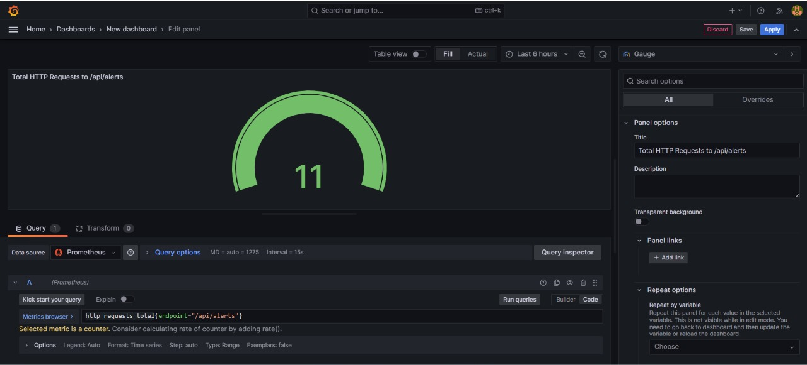
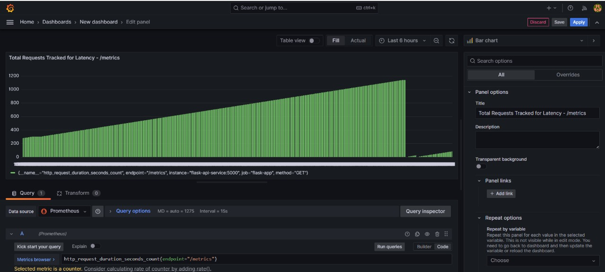
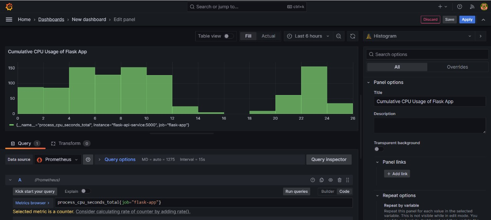
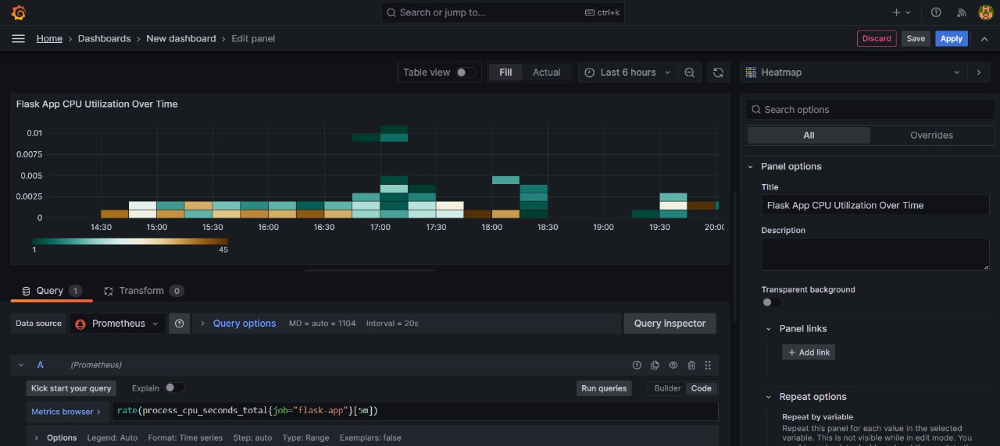
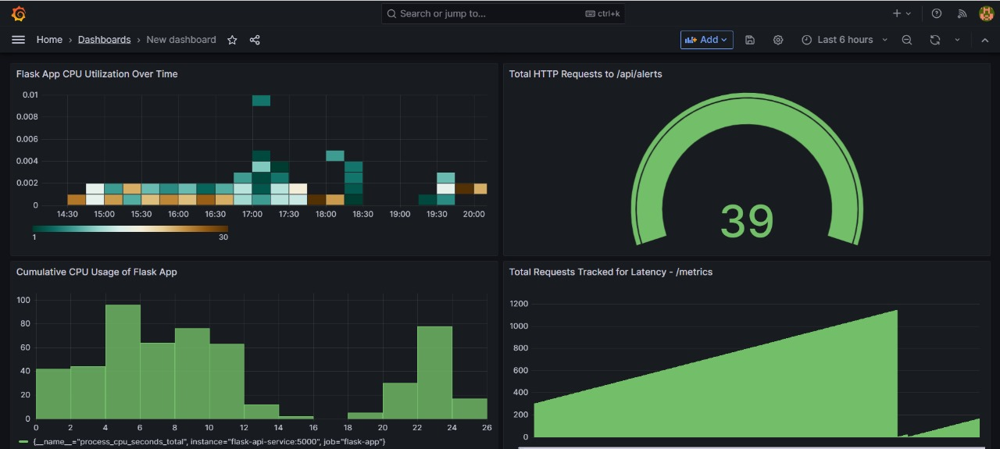
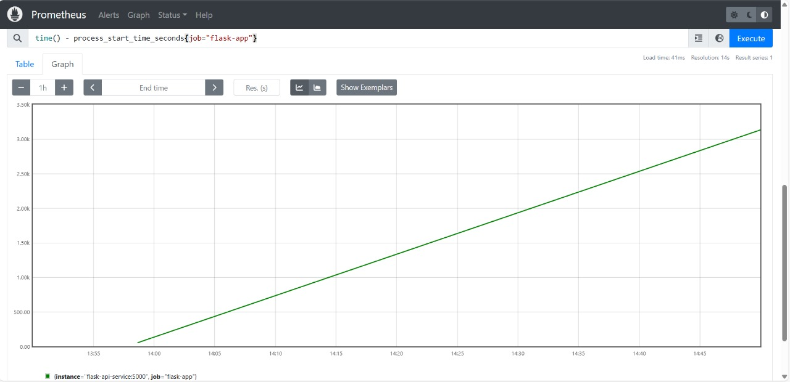
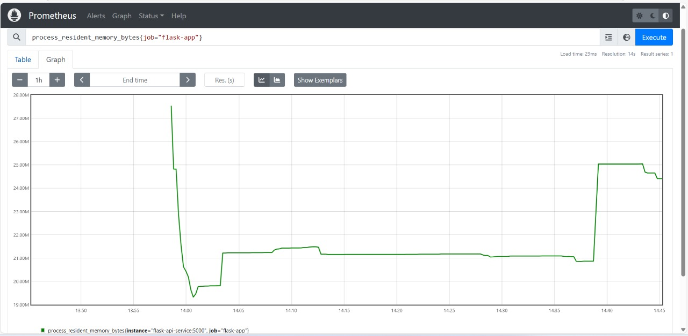

# Grafana and Prometheus Dashboard for SRE Angular App

## Grafana Dashboard Metrics

### 1. HTTP Requests Total
```
http_requests_total{endpoint="/api/alerts"}
```

<p align="center">
  
</p>

This metric tracks the total number of HTTP requests made to the `/api/alerts` endpoint. It helps in monitoring traffic and identifying usage patterns.

### 2. HTTP Request Duration Count
```
http_request_duration_seconds_count{endpoint="/metrics"}
```

<p align="center">
  
</p>

This metric counts the number of recorded HTTP request durations for the `/metrics` endpoint. It is useful for analyzing request frequency and identifying performance bottlenecks.

### 3. CPU Usage of the Flask App
```
process_cpu_seconds_total{job="flask-app"}
```

<p align="center">
  
</p>

This metric represents the total CPU time consumed by the `flask-app` process. It helps in monitoring CPU usage trends and detecting abnormal resource consumption.

### 4. CPU Usage Rate over 5 Minutes
```
rate(process_cpu_seconds_total{job="flask-app"}[5m])
```

<p align="center">
  
</p>

This metric calculates the rate of CPU time consumption over the last 5 minutes for the `flask-app`. It provides a smoothed view of CPU utilization trends, helping in capacity planning and anomaly detection.

### Dashboard
<p align="center">
  
</p>

## Prometheus Metrics

### 1. Uptime of the Flask App
```
time() - process_start_time_seconds{job="flask-app"}
```

<p align="center">
  
</p>

This metric calculates the uptime of the `flask-app` by subtracting the process start time from the current time. It helps in determining how long the application has been running.

### 2. Memory Usage of the Flask App
```
process_resident_memory_bytes{job="flask-app"}
```
<p align="center">
  
</p>

This metric provides the amount of memory currently used by the `flask-app` process. It is useful for monitoring memory consumption and detecting potential memory leaks.
